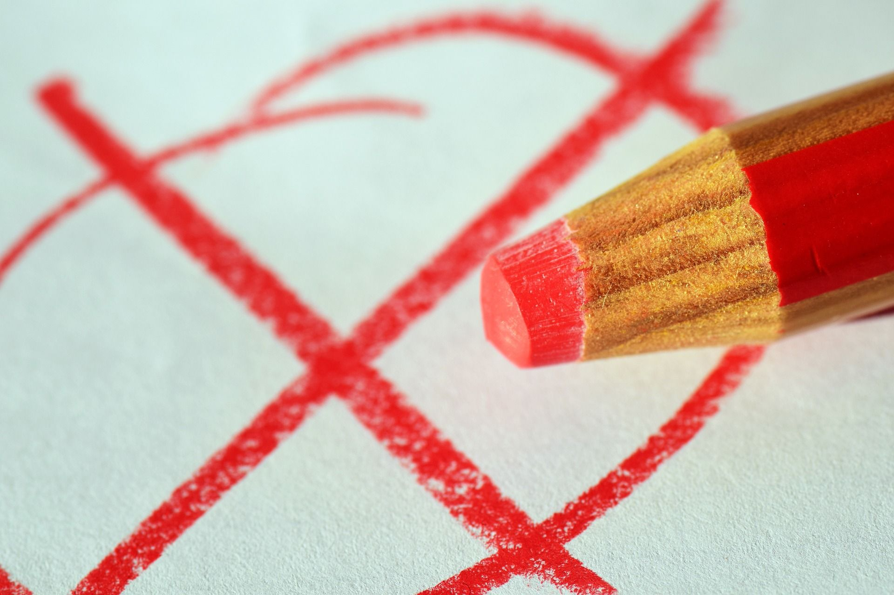

# Voting Systems

---

# Agenda

1. Voting System
2. Voter Turnout and Solution
3. Different Types of Voting Systems
4. Comparison
5. Interactive Part
6. Conclusion

---

## What is a Voting System?

- Electing candidates or deciding on issues by casting and counting votes
- Many different types of voting systems
- Each with advantages and disadvantages

---

## Voter Turnout

---

## Online Voting

1. Pros

   Convenient, accessible, and efficient

2. Cons

   Security concerns and potential for hacking or fraud

3. Comparison

   Compared to traditional voting methods, online voting has both advantages and drawbacks.

---

## Block Chain Voting

|     Advantages     | Disadvantages |
| :----------------: | :-----------: |
| Increased security |  Complexity   |
|      Accuracy      |     Costs     |

---

## First-Past-The-Post (FPTP)

- FPTP is the most commonly used voting system
- Cast a single Vote and most Votes win
- Simple and easy to understand
- "Wasted" votes and disproportionate representation

---

## Single Transferable Vote (STV)

- Ranking in order of preference
- Ensure that each vote counts
- Excess votes from winning candidates to other candidates
- Highly representative and promote voter satisfaction
- Complex with high resources

---

## Ranked Choice Voting (RCV)

- Ranked voting system in order of preference
- If no candidate receives a majority...
- ...Elimination of least votes
- Continues until one candidate has a majority of votes
- More representative
- More time consuming

---

## Comparison

| Voting System | Pros                                    | Cons                                  |
| ------------- | --------------------------------------- | ------------------------------------- |
| FPTP          | Simple and easy to understand           | " Wasted" votes and no representation |
| STV           | Each vote counts                        | High resources                        |
| RCV           | Representative with Elimination process | Time consuming                        |

---

# Interactive Part

---

## Conclusion

- Many different types of voting systems
- Own strengths and weaknesses
- As voters it's important to understand how voting systems work and how they can affect election outcomes and representation
- More fair and representative outcomes

---

## References

Ayadi, M., Amor, N., Lang, J., Peters, D. (2019). Single Transferable Vote: Incomplete Knowledge and Communication Issues. Adaptive Agents and Multi-Agent Systems.

Bartholdi, J. & Orlin, J. (2015). Single transferable vote resists strategic voting. Social Choice and Welfare, 8, 341-354.

Blais, A. (2006). What affects voter turnout?. Annu. Rev. Polit. Sci., 9, 111-125.

---

## References

Chakrabarty, A. (2018). Is the First-Past-the-Post Necessarily the First? Studies in Microeconomics, 6, 133 - 139.

Geys, B. (2006). Explaining voter turnout: A review of aggregate-level research. Electoral studies, 25(4), 637-663.

Green, D., & Gerber, A. (2019). Get out the vote: How to increase voter turnout. Brookings Institution Press.

---

## References

Heilman, S. (2022). Noise Stability of Ranked Choice Voting.

Hepple, B. (2015). First Past the Post.

Nordmann, L., & Pham, H. (1999). Weighted voting systems. IEEE Transactions on Reliability, 48(1), 42-49.

---

## References

Nurmi, H. (2012). Comparing voting systems. Springer Science & Business Media

Patašius, M. (2022). Suitability of the Single Transferable Vote as a Replacement for Largest Remainder Proportional Representation. Symmetry, 14, 1648.

Rivest, R. (2006). The threeballot voting system.

---

## References

Santucci, J. (2021). Variants of Ranked-Choice Voting from a Strategic Perspective.

Simmons, A., Gutiérrez, M., Transue, J. (2022). Ranked-Choice Voting and the Potential for Improved Electoral Performance of Third-Party Candidates in America. American Politics Research, 50, 366 - 378.

Smyth, B. (2017). First-past-the-post suffices for ranked voting.

---

# Thank you for your attention !
